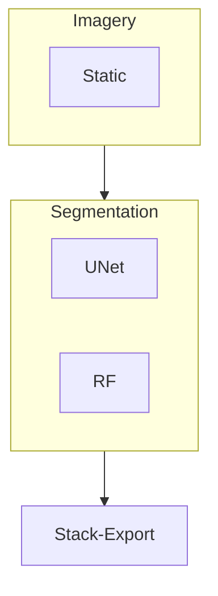
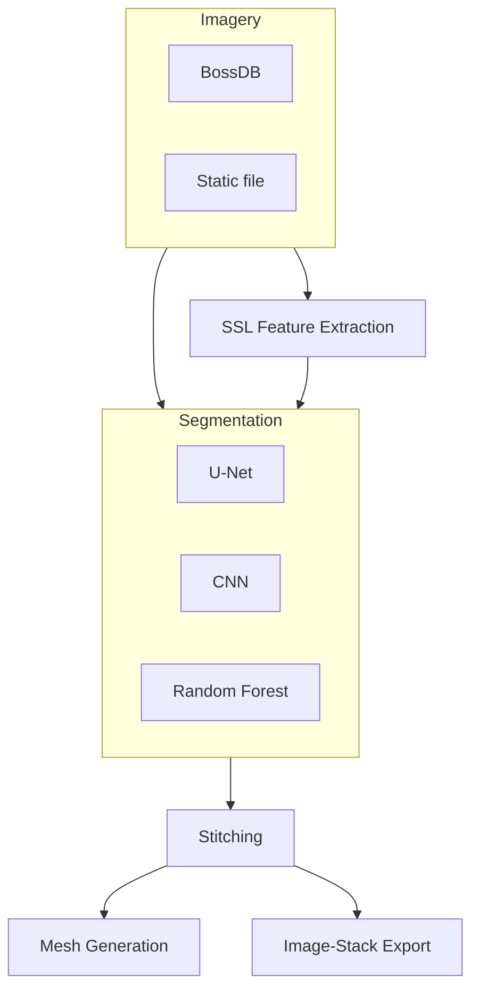

# ml4paleo

[Engineering Plan](https://docs.google.com/document/d/1BuTvtSXZQfS_Un_U-ajgUmIym87JF7aQ8JJHcVwQj_M/edit?usp=sharing)

## Overview

The goal of this project is to build an image segmentation pipeline for fossil X-ray tomography. The pipeline will be packaged and available either as a standalone Python package or as a hosted web service, with data either from a local file or from a cloud-based data host such as BossDB.

## MVP



## Extended



In practice, the `Imagery` nodes are implementations of `VolumeProvider`s; the `Segmentation` nodes implement the `Segmentation3D` interface.

All post-processing steps should implement the `Postprocessor` interface.

The self-supervised feature extraction step is a TODO.

## Running the web app with Docker

```shell
docker run -it -p 5000:5000 python:3.9 bash

# inside the container
poetry install
cd webapp
poetry run python main.py
```
