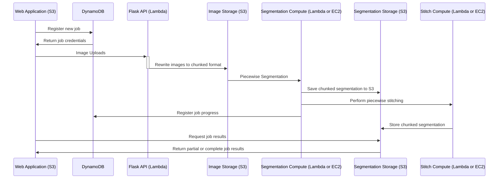

```mermaid
sequenceDiagram

Web Application (S3) ->> DynamoDB: Register new job
DynamoDB ->> Web Application (S3): Return job credentials
Web Application (S3) ->> +Flask API (Lambda): Image Uploads
Flask API (Lambda) ->> -Image Storage (S3): Rewrite images to chunked format
Image Storage (S3) ->> Segmentation Compute (Lambda or EC2): Piecewise Segmentation
Segmentation Compute (Lambda or EC2) ->> Segmentation Storage (S3): Save chunked segmentation to S3

Segmentation Compute (Lambda or EC2) ->> Stitch Compute (Lambda or EC2): Perform piecewise stitching
Segmentation Compute (Lambda or EC2) ->> DynamoDB: Register job progress
Stitch Compute (Lambda or EC2) ->> Segmentation Storage (S3): Store chunked segmentation

Web Application (S3) ->> Segmentation Storage (S3): Request job results
Segmentation Storage (S3) ->> Web Application (S3): Return partial or complete job results
```
